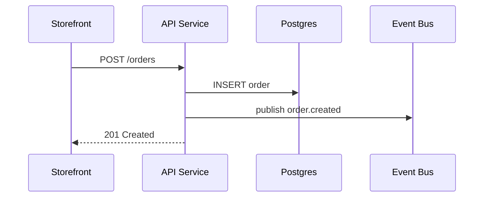

Maintain a file-based C4 architecture at `./architecture/` (relative to the project root). The on-disk layout mirrors the Tecture data model but replaces UUIDs with slugs and moves long-form node descriptions into standalone markdown files.

## Directory layout

```
architecture/
├── manifest.json              # architecture metadata + diagram list
├── diagrams/
│   └── <diagram-slug>.json    # one file per diagram
└── descriptions/
    └── <node-id>.md           # one file per unique node id
```

- Slugs are kebab-case (`[a-z0-9]+(-[a-z0-9]+)*`).
- Node ids must be **globally unique across all diagrams** — the description filename is the node id.
- Cross-diagram drill-down uses `subDiagramId = "<other-diagram-slug>"`, not a UUID.

## File formats

### `manifest.json`

```jsonc
{
  "name": "E-Commerce Platform",
  "description": "Plain-text, 2-4 paragraphs separated by \\n\\n. No markdown.",
  "topDiagram": "system-context",
  "diagrams": ["system-context", "containers", "components-api"],
}
```

### `diagrams/<slug>.json`

```jsonc
{
  "name": "System Context",
  "level": 1,
  "meta": { "direction": "TB" },
  "nodes": [
    {
      "id": "ecommerce",
      "label": "E-Commerce Platform",
      "subDiagramId": "containers",
      "meta": { "type": "system" },
    },
  ],
  "edges": [
    {
      "id": "e-customer-ecommerce",
      "source": "customer",
      "target": "ecommerce",
      "label": "uses",
      "meta": { "type": "calls" },
    },
  ],
}
```

Nodes omit the `description` field entirely — prose lives in `descriptions/<node.id>.md`.

### `descriptions/<node-id>.md`

Free-form GitHub-flavored markdown. Convention: 1–2 sentence summary, then `## Responsibilities` and `## Tech Stack` sections.

**Embed mermaid diagrams** with a standard fenced block (```` ```mermaid ````). The viewer renders the block inline as an SVG and lets users click an expand affordance to open a full-screen lightbox — useful for illustrating runtime behavior that the static C4 diagram cannot: request/response sequences, state machines, decision flows, retry/error branches. Any diagram type mermaid supports works (`sequenceDiagram`, `flowchart`, `stateDiagram-v2`, `erDiagram`, `classDiagram`, `gantt`, …).

Use mermaid sparingly — one diagram per description, only when the prose is easier to grasp with a picture. If a description needs several diagrams, that's usually a hint to split the component into smaller nodes.

Example description with a mermaid block:

````markdown
Node.js REST API backing the storefront and admin app.

## Responsibilities
- Authenticate sessions and authorise requests
- Create orders and publish `order.created` to the event bus

## Checkout Sequence


````

Full schema details (all fields, enums, constraints): see [reference/schema.md](reference/schema.md).
Minimal working example: see [reference/example/](reference/example/).
Machine-readable schemas (JSON Schema Draft 2020-12): [schemas/manifest.schema.json](schemas/manifest.schema.json), [schemas/diagram.schema.json](schemas/diagram.schema.json).

## Workflow

Follow C4 hierarchy: L1 (System Context) → L2 (Container) → L3 (Component, optional).

1. **Plan the levels.** What external actors interact with the system (L1)? What containers live inside (L2)? Which containers need internal detail (L3)?
2. **Create the deepest diagrams first** so their slugs exist before parents reference them via `subDiagramId`.
3. **For each diagram:** write `diagrams/<slug>.json` following the schema, then create a `descriptions/<node-id>.md` for **every** node.
4. **Write `manifest.json`** with `name`, `description`, `diagrams` (all slugs), and `topDiagram` set to the L1 slug.
5. **Validate** (see below). Fix every error before reporting success.

Keep diagrams small — 3–5 nodes for L1, 4–8 for L2, 3–6 for L3. If a diagram grows beyond that, split it into a deeper level.

## Updating an existing architecture

- Adding a node: write the node object, write the description `.md`, add an edge if applicable, then re-validate.
- Renaming a node id: rename the description file to match, update every `parentId`/`subDiagramId`/`source`/`target` reference, then re-validate.
- Removing a diagram: remove the file, remove the slug from `manifest.diagrams`, clear any `subDiagramId` that pointed to it, and delete description `.md`s for nodes that no longer appear anywhere.

Write the complete file each time — do not try to patch JSON by hand with partial objects.

## Validation (always run before reporting done)

Run the bundled validator from the project root:

```
node ~/.claude/skills/tecture/scripts/validate.mjs
```

By default it checks `./architecture`. Pass a path to validate a different location: `node ~/.claude/skills/tecture/scripts/validate.mjs path/to/other-arch`.

The validator checks:

- **Shape** — every file matches the JSON Schema (field presence, types, enum values, slug patterns, no unknown fields).
- **Manifest consistency** — `topDiagram` is listed in `diagrams[]`; every listed slug has a matching `diagrams/<slug>.json`; files on disk that aren't listed produce a warning.
- **Node references** — `parentId` points to a same-diagram node whose `meta.isContainer` is true; `subDiagramId` points to an existing diagram slug and is not self-referential.
- **Edge references** — `source` and `target` resolve to nodes in the same diagram.
- **Global node-id uniqueness** — node ids don't collide across diagrams (required because descriptions are keyed by node id).
- **Descriptions** — every node id has a matching `descriptions/<id>.md`; orphan description files produce a warning.
- **Cycles** — the `subDiagramId` drill-down graph is acyclic.

Exit codes: `0` success, `1` validation failure, `2` internal error. Non-zero exit means there is still work to do — fix and re-run.
