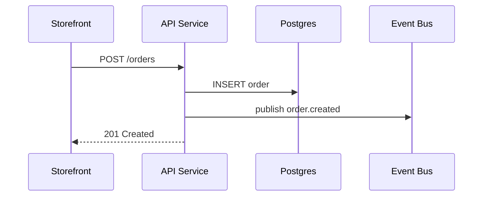

Maintain a file-based C4 architecture at `./architecture/` (relative to the project root). The on-disk layout mirrors the Tecture data model but replaces UUIDs with slugs and moves long-form node descriptions into standalone markdown files.

A good architecture is **grounded in the repo** (every node, edge, and technology corresponds to something concrete in the code), **right-sized per level** (L1 hides internals; L3 only appears when there is genuine internal complexity), and **comprehensible in 60 seconds** to a new engineer reading only the L1 diagram. The full quality bar is in the [Quality checklist](#quality-checklist) below — apply it before validation.

## Directory layout

```
<project-root>/
├── architecture/
│   ├── manifest.json          # architecture metadata + diagram list
│   ├── diagrams/
│   │   └── <diagram-slug>.json  # one file per diagram
│   └── descriptions/
│       └── <node-id>.md       # one file per unique node id
└── .tecture/                  # viewer-managed state (optional, auto-created)
    └── layouts/<slug>.json    # per-diagram node positions/sizes
```

- Slugs are kebab-case (`[a-z0-9]+(-[a-z0-9]+)*`).
- Node ids must be **globally unique across all diagrams** — the description filename is the node id.
- Cross-diagram drill-down uses `subDiagramId = "<other-diagram-slug>"`, not a UUID.
- `.tecture/` (at the project root, sibling to `architecture/`) is written by the Tecture viewer when users drag or resize nodes. Authoring agents must not hand-edit it. Deleting it is always safe — ELK auto-layout recomputes positions on the next load, and future user edits will recreate entries as needed. Commit or ignore it based on whether your team wants shared canonical layouts.

## File formats

### `manifest.json`

```jsonc
{
  "name": "E-Commerce Platform",
  "description": "Plain-text, 2-4 paragraphs separated by \\n\\n. No markdown.",
  "topDiagram": "system-context",
  "diagrams": ["system-context", "containers", "components-api"],
}
```

### `diagrams/<slug>.json`

```jsonc
{
  "name": "System Context",
  "level": 1,
  "meta": { "direction": "TB" },
  "nodes": [
    {
      "id": "ecommerce",
      "label": "E-Commerce Platform",
      "subDiagramId": "containers",
      "meta": { "type": "system" },
    },
  ],
  "edges": [
    {
      "id": "e-customer-ecommerce",
      "source": "customer",
      "target": "ecommerce",
      "label": "uses",
      "meta": { "type": "calls" },
    },
  ],
}
```

Nodes omit the `description` field entirely — prose lives in `descriptions/<node.id>.md`.

### Nesting within a diagram

A node can group 2–4 sibling nodes that share a runtime boundary by using `parentId` and setting `meta.isContainer: true` on the parent. The viewer renders the parent as a labeled container with its children laid out inside.

```jsonc
{
  "nodes": [
    { "id": "controllers", "label": "HTTP Controllers", "meta": { "type": "gateway", "isContainer": true } },
    { "id": "auth-controller",    "label": "Auth Controller",    "parentId": "controllers", "meta": { "type": "service" } },
    { "id": "catalog-controller", "label": "Catalog Controller", "parentId": "controllers", "meta": { "type": "service" } },
    { "id": "order-controller",   "label": "Order Controller",   "parentId": "controllers", "meta": { "type": "service" } },
    { "id": "order-service",      "label": "Order Service",      "meta": { "type": "service" } }
  ]
}
```

Constraints: children must live in the **same diagram** as the parent; the parent must set `meta.isContainer: true`; nesting is **one level deep** (no grandchildren — the validator rejects a grandchild and points you to `subDiagramId` instead).

**Grouping vs. drill-down.** Two mechanisms, one decision:

- **2–4 things share an obvious runtime boundary and belong on the same level?** Use `parentId` (same diagram). Edges into/out of the group still work.
- **3+ things warrant their own page, with edges only the reader at that level should see?** Use `subDiagramId` (separate diagram, next C4 level).
- **Default**: flat. Don't nest if the grouping isn't load-bearing.

### `descriptions/<node-id>.md`

Free-form GitHub-flavored markdown. Convention: 1–2 sentence summary, then `## Responsibilities` and `## Tech Stack` sections.

**Embed mermaid diagrams** with a standard fenced block (```` ```mermaid ````). The viewer renders the block inline as an SVG and lets users click an expand affordance to open a full-screen lightbox — useful for illustrating runtime behavior that the static C4 diagram cannot: request/response sequences, state machines, decision flows, retry/error branches. Any diagram type mermaid supports works (`sequenceDiagram`, `flowchart`, `stateDiagram-v2`, `erDiagram`, `classDiagram`, `gantt`, …).

Use mermaid sparingly — one diagram per description, only when the prose is easier to grasp with a picture. If a description needs several diagrams, that's usually a hint to split the component into smaller nodes.

Example description with a mermaid block:

````markdown
Node.js REST API backing the storefront and admin app.

## Responsibilities
- Authenticate sessions and authorise requests
- Create orders and publish `order.created` to the event bus

## Checkout Sequence


````

Full schema details (all fields, enums, constraints): see [reference/schema.md](reference/schema.md).
Minimal working example: see [reference/example/](reference/example/).
Machine-readable schemas (JSON Schema Draft 2020-12): [schemas/manifest.schema.json](schemas/manifest.schema.json), [schemas/diagram.schema.json](schemas/diagram.schema.json).

## Workflow

Three phases — **Discover → Map → Author**. Do not skip Phase A and dive straight into JSON; the most common failure mode is a generic, template-shaped architecture that names the right C4 levels but misses what makes *this* repo distinctive.

Stack-specific recipes, an external-system catalog, and a worked example live in [reference/discovery.md](reference/discovery.md). Read it once before authoring an architecture for an unfamiliar repo shape.

### Phase A — Discover (read-only)

Before writing any JSON, gather evidence for these seven artifacts. **Do not guess** — find the file or dependency that proves it.

1. **Repo shape** — single app, monorepo (one or many deployables), microservices, library/SDK, CLI, mobile, data pipeline. Detect from workspace files (`pnpm-workspace.yaml`, `lerna.json`, `turbo.json`, `go.work`, Cargo workspaces), top-level directories (`packages/`, `services/`, `apps/`, `cmd/`), and the count of `Dockerfile`s.
2. **Primary stack** — read every `package.json`, `pyproject.toml`, `requirements*.txt`, `Cargo.toml`, `go.mod`, `pom.xml`, `build.gradle`, `Gemfile`, `composer.json`, `mix.exs`. Note the *frameworks* (Next.js, FastAPI, Django, NestJS, Spring Boot, gin, axum), not just the language.
3. **Deployables** — anything that runs as a long-lived process: `Dockerfile`s, `docker-compose.yml` services, `Procfile`, `serverless.yml`, k8s manifests, GitHub Actions deploy jobs, `bin/` entry points, `scripts.start`/`scripts.dev`.
4. **Datastores & infra** — env vars matching `*_URL`/`*_DSN`/`*_HOST`/`*_BUCKET`; ORM configs (`prisma/schema.prisma`, Django `DATABASES`, `alembic.ini`); IaC under `terraform/`/`cdk/`/`pulumi/`.
5. **External SDKs / SaaS** — provider SDK imports (`stripe`, `@sendgrid/*`, `@aws-sdk/*`, `boto3`, `openai`, `@anthropic-ai/sdk`, `@clerk/*`, `@sentry/*`); webhook routes; OAuth providers. Each match is usually an external node.
6. **Actors / personas** — distinct frontends (admin vs end-user), auth roles, public API consumers, CLI users, cron/CI callers. Different behaviors → different person nodes.
7. **Purpose** — top-level README + the `description` field in the package manifest + the primary entry point. This seeds `manifest.description` and the top-system description.

### Phase B — Map discovery → C4

Translate evidence using the patterns in [reference/discovery.md](reference/discovery.md). Universal rules:

- **L1 (System Context)** — one node for the system + person actors + every external SaaS/datastore that lives outside *your* deployable boundary. **3–5 nodes total. Never name internal services here.**
- **L2 (Containers)** — one node per deployable from A3 + one node per managed datastore/broker from A4 + each external from A5. **4–8 nodes**, edges with concrete labels (`REST`, `gRPC`, `order.created`, `reads/writes`).
- **L3 (Components)** — *optional*. Add only when an L2 container has 3+ separable internal parts that genuinely help a reader (e.g. an API split into auth/catalog/orders controllers + repos). **3–6 nodes**, never just a renamed re-arrangement of L2.

Stack idioms differ — a Next.js + Postgres app, a Django monolith, a FastAPI + Celery service, a microservice mesh, a CLI, a data pipeline each get a different L2 shape. Use the matching recipe in [reference/discovery.md](reference/discovery.md) as a starting prior, then adjust to what is actually in the repo.

### Phase C — Author & self-evaluate

1. **Write child diagrams first** (L3 → L2 → L1) so slugs exist before parents reference them via `subDiagramId`.
2. **For each diagram**, write `diagrams/<slug>.json`, then create `descriptions/<node-id>.md` for **every** node. Lead each description with one sentence of *responsibility* — what this node owns, not a rephrasing of its label.
3. **Write `manifest.json`** with `name`, `description` (2–4 plain-text paragraphs), `topDiagram` set to the L1 slug, and `diagrams` listing every slug.
4. **Run the [Quality checklist](#quality-checklist)** against the draft. Fix anything that fails.
5. **Validate** (see below). Fix every error before reporting success.

## Quality checklist

The validator checks *shape*. This checklist checks *meaning* — apply it before running the validator. Aim for ≥10/12 on a fresh architecture; treat any miss as a real defect, not a stylistic preference.

1. **60-second comprehension** — Read only the L1 diagram + the top-system description. Can a new engineer answer "what does this system do, who uses it, what does it depend on"?
2. **Evidence-grounded** — For each node, name the file or dependency that proves it exists (a `Dockerfile`, a `package.json` entry, an env var, an SDK import). No node should be "I think there's probably one of these."
3. **Right abstraction per level** — L1 hides internals; L2 shows deployables and managed infra; L3 appears only when an L2 container has 3+ meaningfully separable parts.
4. **Boundaries match real seams** — Each node corresponds to a deployable, process, package, or module with its own contract. Could you imagine each node being deployed, replaced, or owned independently?
5. **Edges express runtime relationships** — Every edge label is a verb or protocol (`REST`, `gRPC`, `order.created`, `reads/writes`, `webhook`). No `uses` / `depends on` / `interacts with`.
6. **Technology authenticity** — Every `meta.technology` matches a real entry in a manifest, lockfile, or Dockerfile. Use [Simple Icons](https://simpleicons.org) slugs.
7. **Drill-down adds information** — Each `subDiagramId` exposes structure not visible at the parent level. If removing the sub-diagram costs no understanding, delete it. Use `parentId` grouping when 2–4 nodes share a boundary on the same level; reach for `subDiagramId` only when the inner structure earns its own page.
8. **Descriptions explain why, not what** — Strip the heading from any `descriptions/*.md`; you should still be able to tell which node it describes from the responsibilities. If not, the description is too generic.
9. **Coverage of externals** — Grep for `*_URL`, `*_KEY`, and common SDK imports (`stripe`, `boto3`, `@aws-sdk/*`, `openai`, `@anthropic-ai/sdk`). Every match maps to a node.
10. **Diagrams fit on one screen** — L1: 3–5 nodes; L2: 4–8; L3: 3–6. Anything bigger means split into a deeper level.
11. **Stable, code-derived names** — Labels match what the code calls things (directory names, package names, service names). Don't invent synonyms.
12. **Reusable on update** — When code changes (e.g. "we added a Redis cache"), a focused 1–2 file diff should be enough. If a small change forces a rewrite, the boundaries are wrong.

Common anti-patterns to watch for: "Business Logic" / "Service Layer" nodes; L1 diagrams that name internal services; L3 diagrams that just rename L2; edges labeled `uses`; technologies you didn't grep for. See [reference/discovery.md](reference/discovery.md#anti-patterns-do-not-do-these) for the full list.

## Updating an existing architecture

- Adding a node: write the node object, write the description `.md`, add an edge if applicable, then re-validate.
- Renaming a node id: rename the description file to match, update every `parentId`/`subDiagramId`/`source`/`target` reference, then re-validate.
- Removing a diagram: remove the file, remove the slug from `manifest.diagrams`, clear any `subDiagramId` that pointed to it, and delete description `.md`s for nodes that no longer appear anywhere.

Write the complete file each time — do not try to patch JSON by hand with partial objects.

## Validation (always run before reporting done)

Run the bundled validator from the project root. Replace `<SKILL_DIR>` with wherever this skill is installed — commonly `.claude/skills/tecture`, `.github/skills/tecture`, `.cursor/skills/tecture`, or `.agents/skills/tecture`:

```
node <SKILL_DIR>/scripts/validate.mjs
```

By default it checks `./architecture`. Pass a path to validate a different location: `node <SKILL_DIR>/scripts/validate.mjs path/to/other-arch`.

The validator checks:

- **Shape** — every file matches the JSON Schema (field presence, types, enum values, slug patterns, no unknown fields).
- **Manifest consistency** — `topDiagram` is listed in `diagrams[]`; every listed slug has a matching `diagrams/<slug>.json`; files on disk that aren't listed produce a warning.
- **Node references** — `parentId` points to a same-diagram node whose `meta.isContainer` is true, the `parentId` chain has no cycles, and nesting is at most one level deep (grandchildren are rejected — promote to a child diagram via `subDiagramId`). `subDiagramId` points to an existing diagram slug and is not self-referential.
- **Edge references** — `source` and `target` resolve to nodes in the same diagram.
- **Global node-id uniqueness** — node ids don't collide across diagrams (required because descriptions are keyed by node id).
- **Descriptions** — every node id has a matching `descriptions/<id>.md`; orphan description files produce a warning.
- **Cycles** — the `subDiagramId` drill-down graph is acyclic.

Exit codes: `0` success, `1` validation failure, `2` internal error. Non-zero exit means there is still work to do — fix and re-run.
