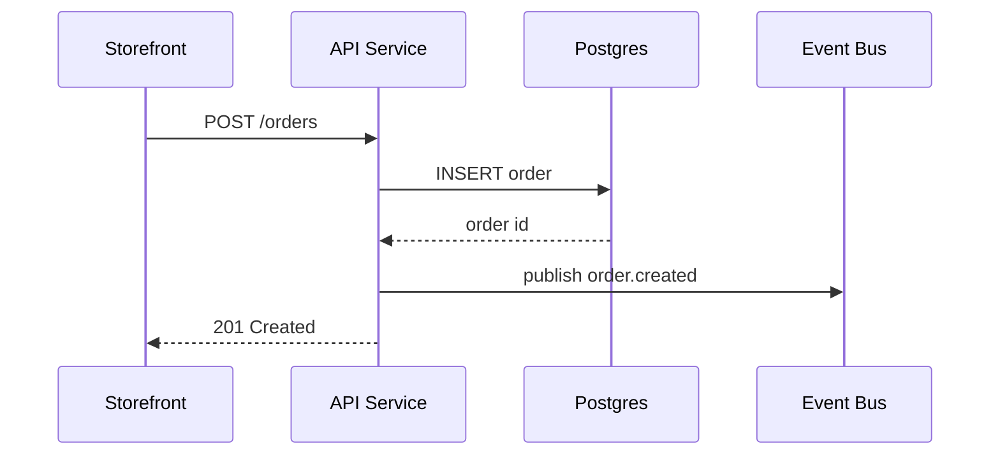

Node.js REST API backing both the storefront and the admin app.

## Responsibilities
- Authentication and session management
- Catalog reads and mutations
- Order creation (publishes `order.created` to the event bus)

## Tech Stack
- Node.js, Express, Prisma

## Order Creation Flow

