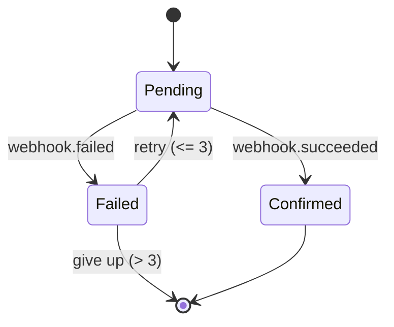

# File-Based Architecture Schema

Detailed reference for the file layout and JSON schemas used by the `tecture` skill.

This is the file-based mirror of the Tecture database schema documented in [/docs/ARCHITECTURE.md](/docs/ARCHITECTURE.md) and [/docs/DIAGRAM_SCHEMA.md](/docs/DIAGRAM_SCHEMA.md). The key differences:

- UUIDs are replaced with kebab-case **slugs** (diagram file names; stable node ids).
- Node `description` is not inlined in JSON — it lives in `descriptions/<node-id>.md`.
- Manual `positions` and other viewer state are not stored (the web viewer rebuilds layout on import).

## Directory layout

```
architecture/
├── manifest.json
├── diagrams/
│   └── <diagram-slug>.json
└── descriptions/
    └── <node-id>.md
```

All paths are relative to the architecture root (default `./architecture` at project root).

## `manifest.json`

Draft 2020-12 JSON Schema: [../schemas/manifest.schema.json](../schemas/manifest.schema.json).

| Field | Type | Required | Notes |
|---|---|---|---|
| `name` | string | yes | Architecture name. |
| `description` | string | no | Plain-text, 2–4 paragraphs separated by `\n\n`. No markdown. |
| `source` | string (URI) | no | Canonical HTTPS URL of the source repository (no `.git` suffix), from `git remote get-url`. Enables node → source links in the viewer. |
| `sourceHost` | `github` \| `gitlab` \| `bitbucket` | no | Repo host provider; selects the file-view URL scheme. Auto-detected from the `source` domain. Unknown values warn (not error). |
| `topDiagram` | slug | yes | Slug of the entry-point diagram. Must appear in `diagrams[]`. |
| `diagrams` | slug[] | yes | Every diagram slug that belongs to this architecture. Non-empty, unique. |

Unknown top-level fields are rejected. Slugs match `^[a-z0-9]+(-[a-z0-9]+)*$`.

### Source file-view URL schemes

When a node has a `path` (see below), the web viewer builds a link using `source` + `sourceHost`. `HEAD` resolves to the repo's default branch, so links stay current:

| `sourceHost` | File | Directory |
|---|---|---|
| `github` | `<source>/blob/HEAD/<path>` | `<source>/tree/HEAD/<path>` |
| `gitlab` | `<source>/-/blob/HEAD/<path>` | `<source>/-/tree/HEAD/<path>` |
| `bitbucket` | `<source>/src/HEAD/<path>` | `<source>/src/HEAD/<path>` |

If `sourceHost` is absent the viewer infers it from the `source` domain; if that is also unknown it links to the repo root. Inside the VS Code extension the same `path` opens the file in an editor (or reveals the folder) instead of using a web URL.

## `diagrams/<slug>.json`

Draft 2020-12 JSON Schema: [../schemas/diagram.schema.json](../schemas/diagram.schema.json).

### Top-level

| Field | Type | Required | Notes |
|---|---|---|---|
| `name` | string | yes | Human-readable diagram title (e.g. `"System Context"`, `"API Service – Components"`). |
| `level` | 1 \| 2 \| 3 | no | C4 level hint. 1 = System Context, 2 = Container, 3 = Component. |
| `meta.direction` | `"TB"` \| `"LR"` | no | Layout direction. Default `TB`. |
| `meta.layout` | string | no | Layout engine hint (opaque to the skill). |
| `nodes` | Node[] | yes | Non-empty. |
| `edges` | Edge[] | no | Defaults to `[]`. |

### Node

| Field | Type | Required | Notes |
|---|---|---|---|
| `id` | slug | yes | **Globally unique** across every diagram in the architecture. Matches the filename under `descriptions/`. |
| `label` | string | yes | Display name. |
| `parentId` | slug \| null | no | Another node's `id` **in the same diagram** whose `meta.isContainer = true`. Groups 2–4 sibling nodes under a labeled container. One level of nesting only — grandchildren are rejected; use `subDiagramId` for deeper decomposition. See [How diagrams relate](#how-diagrams-relate). |
| `subDiagramId` | slug \| null | no | Another diagram's slug (drill-down target). Must exist under `diagrams/`. Self-reference is forbidden. See [How diagrams relate](#how-diagrams-relate). |
| `path` | string | no | Repo-root-relative path to the single file or directory this node maps to. Trailing `/` denotes a directory. No leading `/`, no `..`. Set only when the node is exactly one file or folder. The validator warns (never errors) if the path is missing on disk or its file/dir kind disagrees with the trailing slash. |
| `meta.type` | enum | no | One of `system`, `person`, `service`, `database`, `queue`, `gateway`, `frontend`, `cache`, `storage`, `external`. |
| `meta.technology` | slug | no | Free-form tech identity, ideally a [Simple Icons](https://simpleicons.org) slug (`postgresql`, `react`, `aws-s3`). |
| `meta.isContainer` | boolean | no | If `true`, this node groups child nodes (those that set `parentId` to this id). |

Nodes **must not** carry a `description` field — descriptions live in `descriptions/<id>.md`.

### Edge

| Field | Type | Required | Notes |
|---|---|---|---|
| `id` | slug | yes | Unique within the diagram. Convention: `e-<source>-<target>`. |
| `source` | string | yes | Must match a node `id` in the same diagram. |
| `target` | string | yes | Must match a node `id` in the same diagram. |
| `label` | string | no | Short relationship label (`"REST API"`, `"gRPC"`, `"reads/writes"`, `"order.created"`). |
| `meta.type` | enum | no | One of `calls`, `reads`, `writes`, `publishes`, `subscribes`, `data-flow`. |

Edges cannot cross diagram boundaries. Cross-level relationships are expressed with `subDiagramId`, not edges.

## `descriptions/<node-id>.md`

GitHub-flavored markdown. No required structure, but the convention is:

```markdown
One- or two-sentence summary of what this component does.

## Responsibilities
- …
- …

## Tech Stack
- …
```

Filename must be exactly `<node.id>.md`. Orphan files (no matching node id anywhere) generate a warning.

### Mermaid diagrams

Any fenced block tagged `mermaid` is rendered as an SVG diagram inside the viewer's node detail panel and can be enlarged in a full-screen lightbox. Use this to describe behavior the static C4 diagrams don't show: request/response sequences, lifecycle/state transitions, data flow with branches, queue fan-out, retry logic.

- Supported: every mermaid diagram type (`sequenceDiagram`, `flowchart`, `stateDiagram-v2`, `erDiagram`, `classDiagram`, `gantt`, `journey`, `gitGraph`, `mindmap`, etc.). The viewer bundles the full mermaid distribution.
- Rendering is sandboxed (`securityLevel: "strict"`) — click handlers and inline HTML inside mermaid source are ignored. Stick to standard mermaid syntax.
- Theme variables are set by the viewer to match the blueprint palette (dark background, cyan/blue/emerald accents, mono font). Don't try to override them from inside the fence.
- Style guidance: keep each chart focused (5–10 participants/states). Prefer one chart per description — if a description grows several charts, the underlying component is probably doing too much and should be split into finer nodes.
- Validation is syntactic only (the prose is GFM). Malformed mermaid syntax will surface as an amber error card with the source preserved when the viewer tries to render it.

Example:

````markdown
Stripe webhook receiver that reconciles payment state.

## Retry Flow


````

## How diagrams relate

Three mechanisms, each with a distinct job:

1. **Manifest grouping** — `manifest.diagrams[]` lists sibling diagrams in one architecture. `manifest.topDiagram` identifies the entry point.
2. **Nesting within a diagram (`parentId`)** — a node groups 2–4 sibling nodes under a container (`meta.isContainer: true`). The viewer renders the parent as a labeled boundary with its children laid out inside. One level deep only. Use when the grouping is a runtime boundary (controllers under a router, workers under a pool) but doesn't earn its own page.
3. **Cross-diagram drill-down (`subDiagramId`)** — a node points at another diagram's slug. Clicking it navigates into that diagram. Use when the inner structure is complex enough (3+ nodes with their own edges) to deserve its own page. The drill-down graph must be acyclic.

**When to use which** is an authoring decision, not a schema rule — see the single source of truth under [Nesting within a diagram](../SKILL.md#nesting-within-a-diagram) in SKILL.md. One schema-level caveat: a `parentId` parent is **not** a substitute for a container node in a C4 level — it's a visual grouping of siblings on the same level, and the parent itself still needs a `descriptions/<id>.md`.

## Canonical authoring order

The authoring order (children before parents, since parents reference child slugs — descriptions per node, `manifest.json` last, then validate) is defined once in [SKILL.md's Workflow → Phase C](../SKILL.md#workflow). Run the validator from the project root as `node .claude/skills/tecture/scripts/validate.mjs` — see [SKILL.md → Validation](../SKILL.md#validation-always-run-before-reporting-done).

## Validation rules (what the script checks)

- Every JSON file parses and matches its JSON Schema (shape, enums, slugs, no unknown fields).
- `manifest.topDiagram` is present in `manifest.diagrams`.
- Every slug in `manifest.diagrams` has a file; every file on disk is listed (unlisted files → warning).
- Every `node.parentId` resolves to a same-diagram node with `meta.isContainer = true`; the `parentId` chain is acyclic and at most one level deep (grandchildren rejected).
- Every `node.subDiagramId` resolves to an existing diagram and is not self-referential.
- Every `edge.source` / `edge.target` resolves to a same-diagram node.
- Node ids are globally unique across all diagrams.
- Every node id has a matching `descriptions/<id>.md` (missing → error, orphan → warning).
- The drill-down graph formed by `subDiagramId` is a DAG (no cycles).
